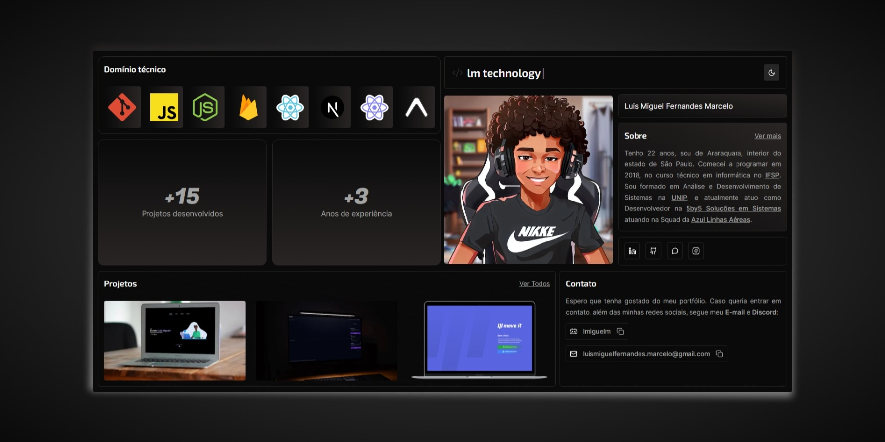

# 🏅 Meu portfólio

Projeto do meu portfólio, desenvolvido utilizando Next 13 e Prismic.

Veja toda meus projetos e minha trajetória no mundo da porgramação.

 

🔛 **Acesse agora mesmo: [lmiguelm](https://lmiguelm.com).**

[<video src=".github/video.mp4" controls="controls"></video>](https://github.com/lmiguelm/me/assets/47677312/c7e8ba65-f2bd-4304-ae1d-014faad84646)

## 🚀 Tecnologias:

Esse projeto foi desenvolvido com as seguintes tecnologias:

- [Next.js](https://vitejs.dev/)
- [Shadcn](https://ui.shadcn.com/)
- [TypeScript](https://www.typescriptlang.org/)
- [TailwindCSS](https://tailwindui.com/)
- [Prismic](https://prismic.io/)

 

## 💻 Como usar

- **_Clone o projeto:_**
  - ` git clone https://github.com/lmiguelm/me.git`

 

- **_Entre nas pastas do projeto:_**
  - `cd me`

 

- **_Baixe as dependências:_**
  - ` pnpm || yarn || npm install`

 

- **_Configure as variáveis de ambiente:_**
  - Utilize como base o arquivo: `.env.example`

 

- **_Rode o site:_**
  - `pnpm dev || yarn dev || npm run dev`
